# Image Classification Using CNN - Custom CNN & MobileNetV2

A Machine Learning (ML) project for image Classification using Custom CNN and MobileNetV2 (CNN with Transfer Learning). In this work, it is utilised for weather Classification.

---

## Overview

A Machine Learning (ML) project for image Classification using Custom CNN and MobileNetV2 (CNN with Transfer Learning). In this work, it is utilised for weather Classification.

## Dataset 

- A combined dataset from Kaggle (<a href="https://drive.google.com/file/d/1PowwArNBoGe9XmYwAhNUPraEiv0qAk2D/view?usp=drive_link" target="_blank" rel="noopener noreferrer">View Dataset</a>) with other open-sources such as Magnific, Wikimedia Commons, and Unsplash
- 1225 Images in Total
- 4 different classes: Sunrise, Shine, Rain, Cloudy

  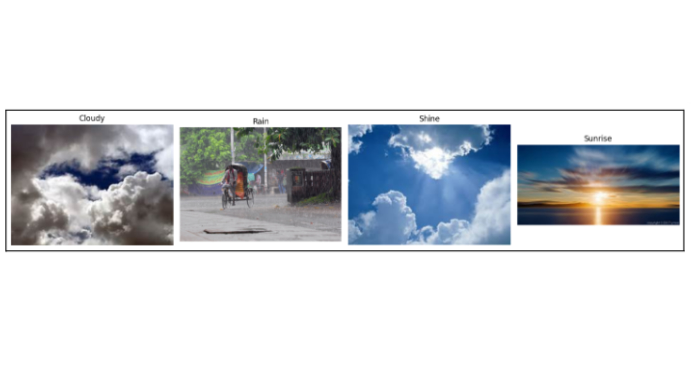
   
  <em>Sample Images for All Classes</em>

## Technologies Used

- **Programming Languages:** Python
- **Data Analysis/EDA:** Pandas, Numpy
- **Data Visualization:** Matplotlib, Seaborn
- **Machine Learning:** Scikit-learn, TensorFlow, Keras
- **Other Libraries:** Python Imaging Library (PIL)
- **Development Tools:** Google Colab

## Data Preprocessing
- **Image Resizing:** All the 1225 images were resized to a consistent dimension of 128 x 128 pixels.
- **Normalization:** Each pixel intensities of the images were rescaled to a normalized range of 0 and 1 by dividing by 255 (255 pixels).

## Data Splitting
- **Stratified Data Split:** 80/20 Split
- **Training Set (80%):** 980 Images
- **Testing Set (80%):** 245 Images

## Custom CNN & MobileNetV2 Architecture 

### Custom CNN Architecture Summary

  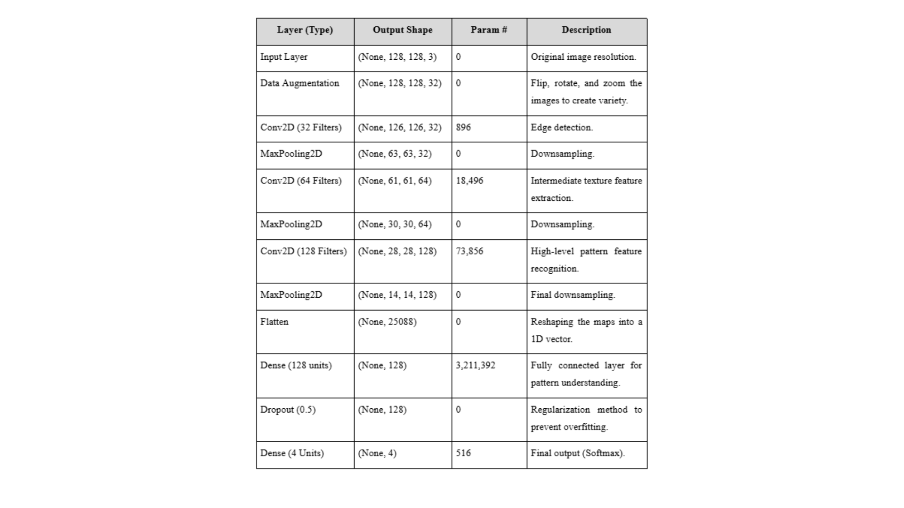
   
  <em>Custom CNN Architecture Summary</em>

### MobileNetV2 Architecture Summary

  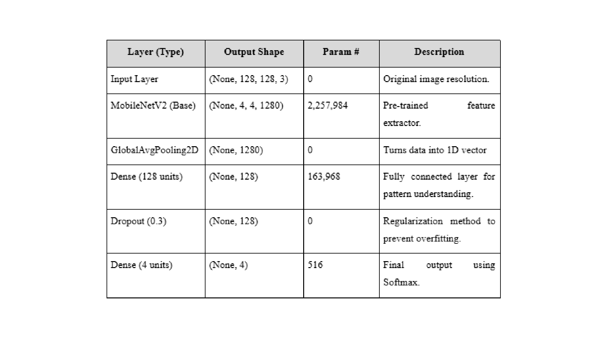
   
  <em>MobileNetV2 Architecture Summary</em>

## Model Parameters 

### Similar Parameters Configurations

  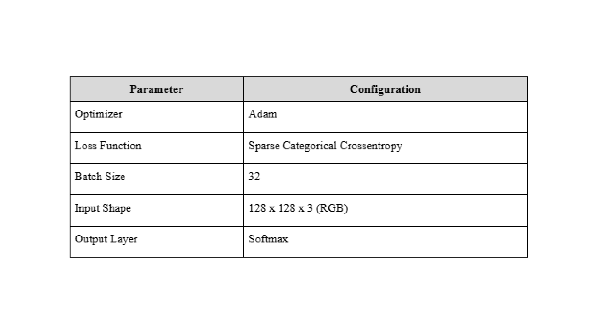
   
  <em>Similar Parameters Configurations For Both Models</em>

### Different Parameters Configurations

  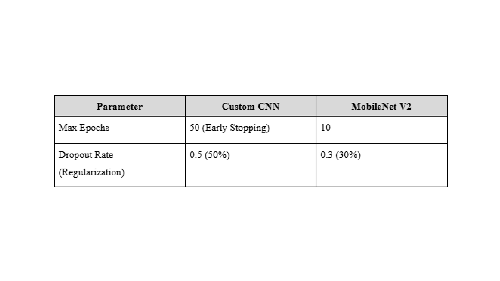
   
  <em>Different Parameters Configurations For Each Model</em>

## Model Evaluation & Results

### Custom CNN

  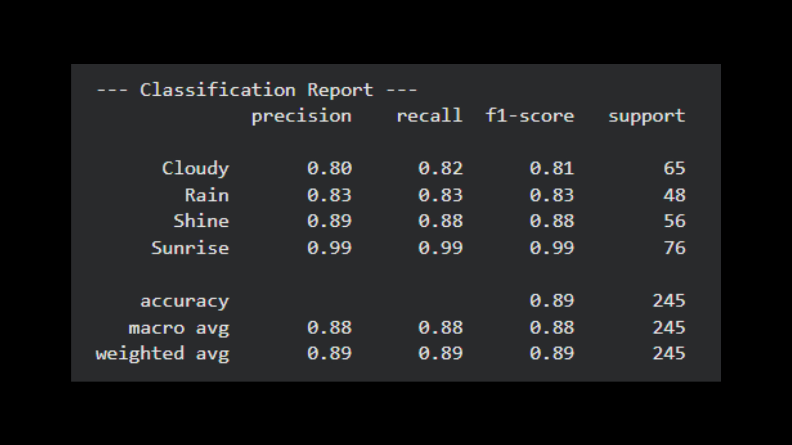
   
  <em>Overall Report for the Custom CNN model.</em>

  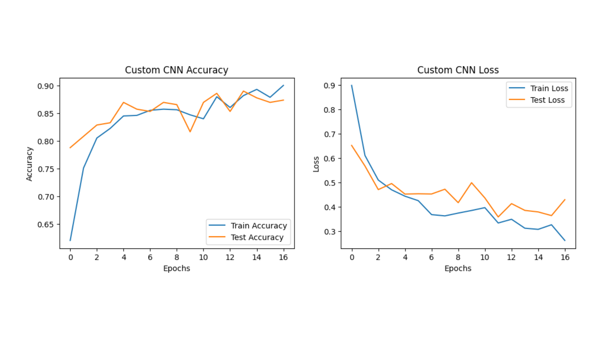
   
  <em>Training and Validation curves for the Custom CNN model.</em>

  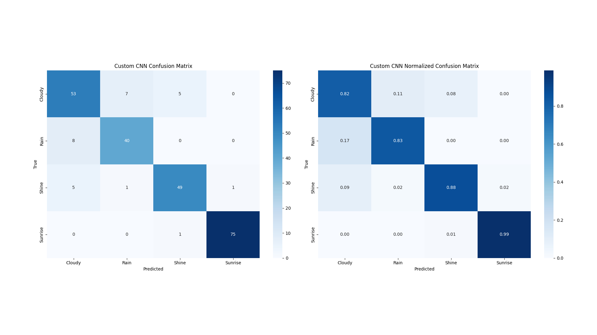
   
  <em>Confusion Matrix for the Custom CNN model.</em>

### MobileNetV2

  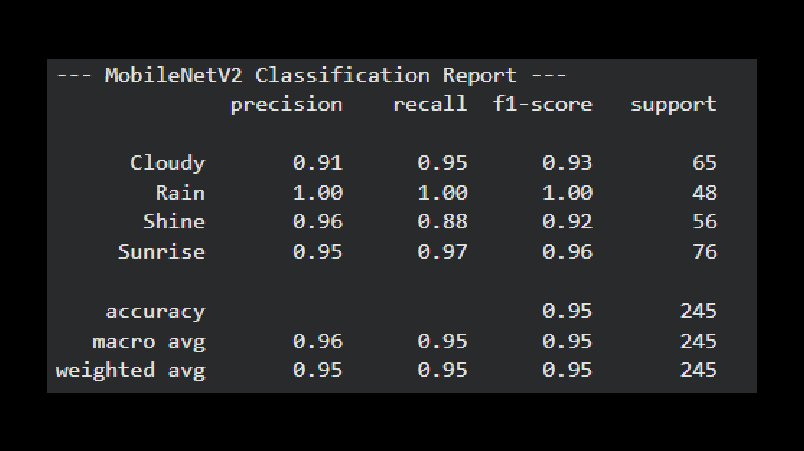
   
  <em>Overall Report for the MobileNetV2 model.</em>

  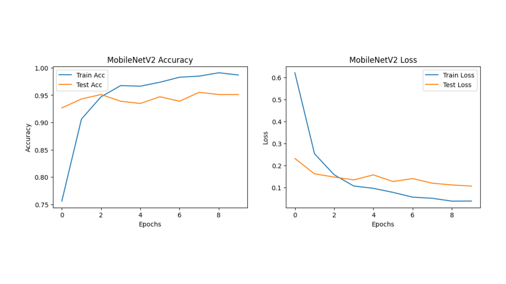
   
  <em>Training and Validation curves for the MobileNetV2 model.</em>

  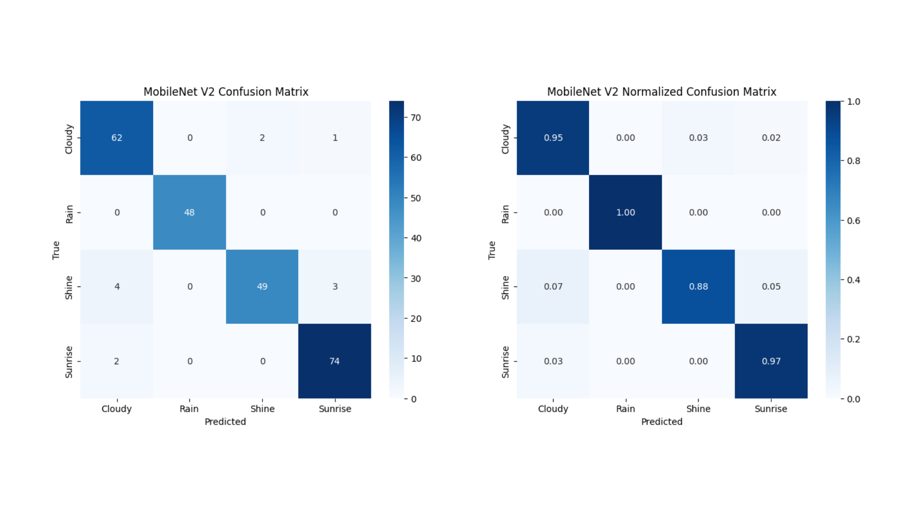
   
  <em>Confusion Matrix for the MobileNetV2 model.</em>

## Overall 
Based on the two CNN model evaluations, the custom CNN and the MobileNet V2 CNN model, it is clear that the MobileNet V2 outperforms better than the custom CNN model. This is due to its pre-trained knowledge that it gathered from over 1 million images. However, the custom CNN is still a great baseline as it has more than 80% accuracy and shows low signs of overfitting. As a conclusion, both CNN models are good for our dataset, as both have quite high accuracy and show low-to-none signs of overfitting.
